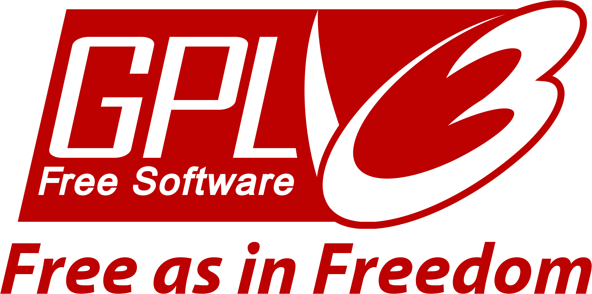

# README Generator  
## Table of Contents
  
* [Goal of the Project](#Goal)
* [Description of the Project](#Description)
* [Install Instructions](#Installation)
* [Project License](#License)
* [Steps For Completion](#Completion)
* [App Tests](#Tests)
* [Questions](#Questions)

  
# <a name="Goal"> Goal of the Project </a>
To create custom readme files.
# <a name="Description"> Description of the Project </a>
An application that allows the user to create custom readme files for any type of project. There is a wide selection of sections to include within the file.
# <a name="Installation"> Install Instructions </a>
Run a terminal window within the project folder and type "npm install" or "npm i" to download any required files to run the app. Create a folder"dist", as here is where the readme is going to be located after creation.
# <a name="License"> Project License </a>
[GNU GPLv3](https://github.com/MacPass/KeePassKit/blob/master/Licenses/GPLv3.license.txt)
# <a name="Completion"> Steps For Completion </a>
- Step 1
- Step 2
   - Step 2.1
   - Step 2.2
- Step 3
# <a name="Tests"> App Tests </a>
This project does not include any test files.
# <a name="Questions"> Questions </a>
  If you have any questions, feel free to contact me through GitHub at 
  [nicolasrojas-ceng](https://github.com/nicolasrojas-ceng).  
  Alternatively, you can contact me at my email: [lucanrojas@gmail.com](mailto:lucanrojas@gmail.com)